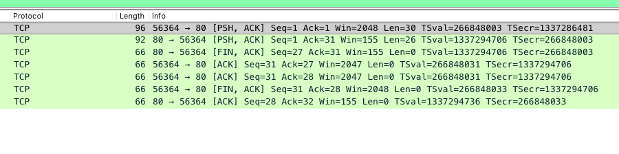
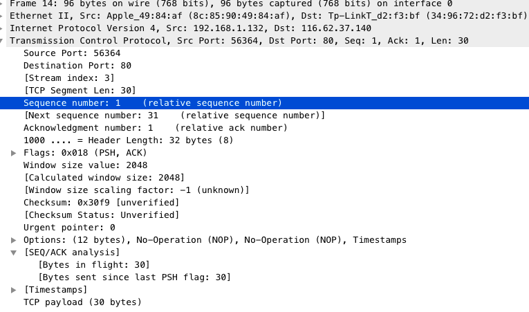
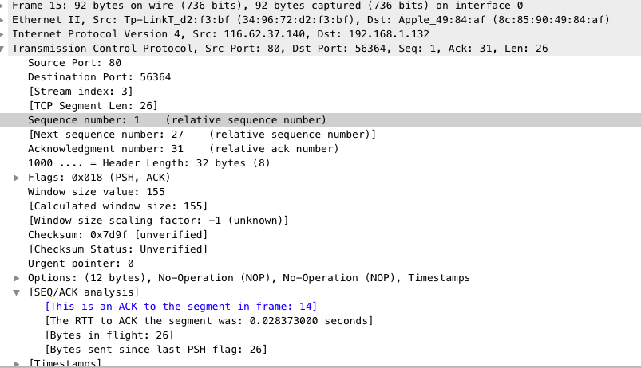
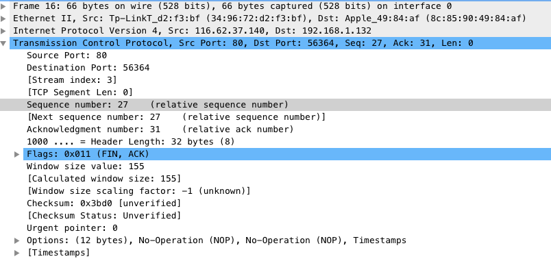
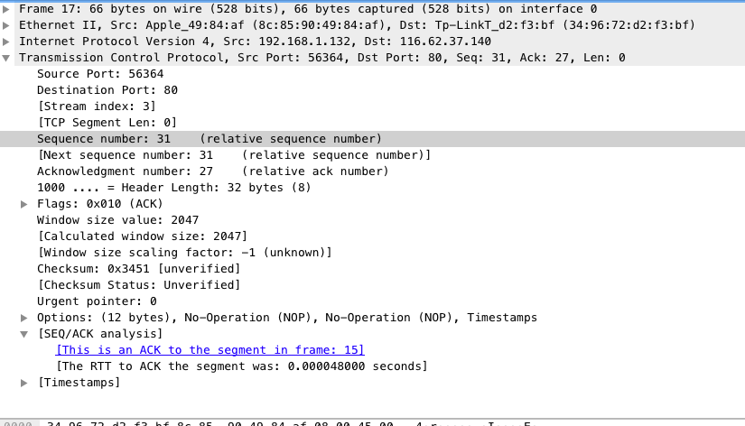
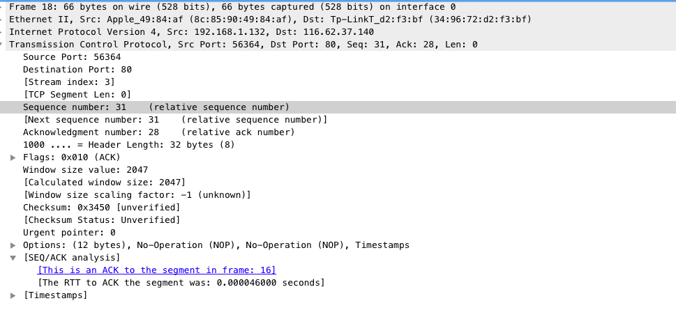
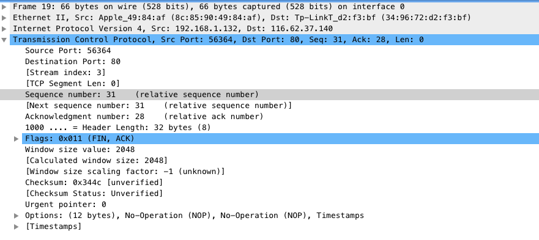
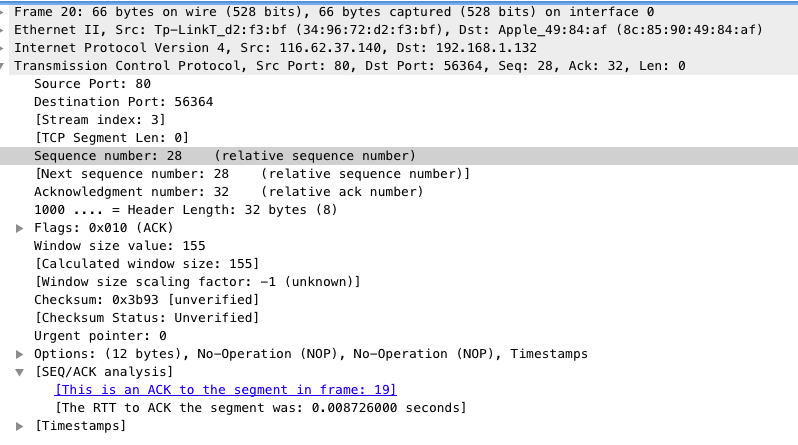

# TCP close过程

序号14～20的`segment`展示了tcp关闭通道的过程

`segment 14`

`segment 15`

`segment 16`

`segment 17`

`segment 18`

`segment 19`

`segment 20`

## 图示
| 方向                        | Sequence number   |Acknowledgment number|Next Sequence number |Tcp Flags|
| -------------------------- | ----------------------- |---------------------|---------------------|---------------|
|         -->               | 1             |1|31|PSH ACK|
|         <--               | 1             |31|27|PSH ACK|
|         <--               | 27         |31|27|FIN|
|         -->               | 31           |27|31|ACK|
|         -->               | 31 |28|31|ACK|
|         -->               | 31           |28|31|FIN|
|         <--               | 28           |32|28|ACK|

左边为client，右边为server