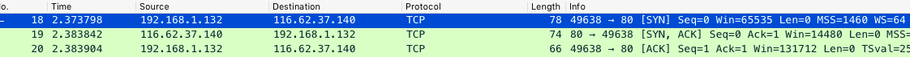
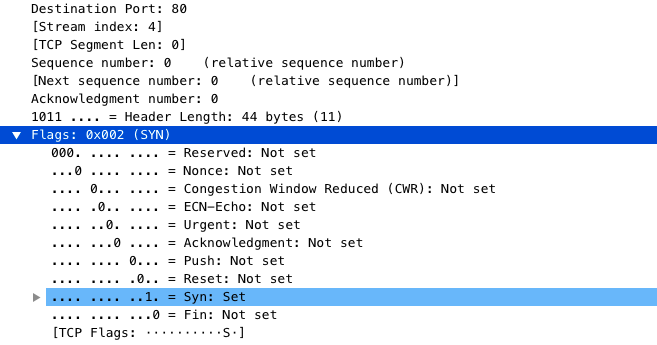
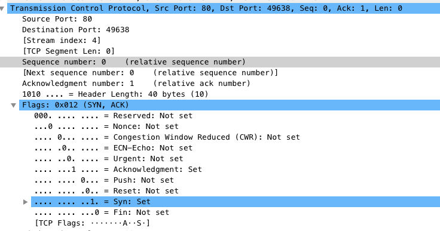
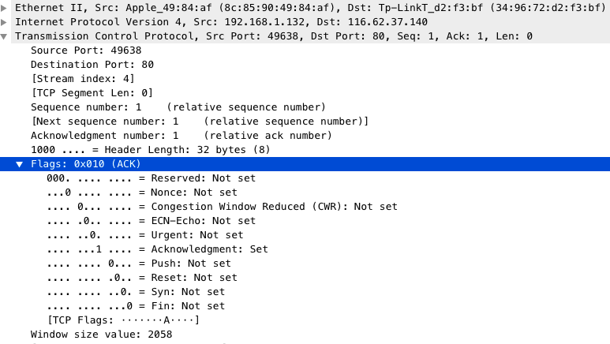

# TCP 3次握手过程

上图中从segment序号18～20为3次握手建立过程

>segment18说明
Tcp Flags将SYN设置为1，同时tcp.seq为0`Sequence number: 0    (relative sequence number)`，客户端请求建立连接

>segment19说明
Tcp Flags将SYN设置为1，同时tcp.seq为0`Sequence number: 0    (relative sequence number)`
`Acknowledgment number: 1    (relative ack number)`，服务端收到客户端请求，向客户端发送一个SYN和ACK都置为1的TCP报文，设置初始序号Y=0，将确认序号(Acknowledgement Number)设置为客户的序列号加1，即X+1 = 0+1=1

>segment20说明
客户端收到服务器发来的包后检查确认序号(Acknowledgement Number)是否正确，即第一次发送的序号加1（X+1=1）。以及标志位ACK是否为1。若正确，服务器再次发送确认包，ACK标志位为1，SYN标志位为0。确认序号(Acknowledgement Number)=Y+1=0+1=1，发送序号为X+1=1。客户端收到后确认序号值与ACK=1则连接建立成功