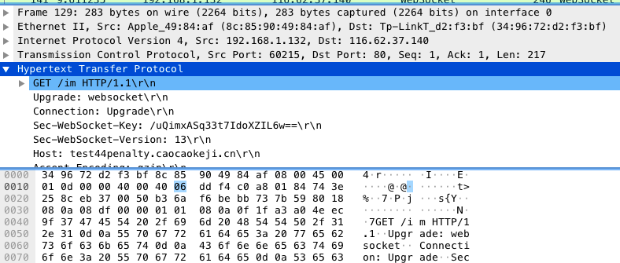

# WireShark抓包使用

## WireShark抓包说明

上图为一个tcp包，结构如下

 - Frame 137: 66 bytes on wire (528 bits), 66 bytes captured (528 bits) on interface 0
 - Ethernet II, Src: Apple_49:84:af (8c:85:90:49:84:af), Dst: Tp-LinkT_d2:f3:bf (34:96:72:d2:f3:bf)
 - Internet Protocol Version 4, Src: 192.168.1.132, Dst: 116.62.37.140
 - Transmission Control Protocol, Src Port: 60215, Dst Port: 80, Seq: 480, Ack: 841, Len: 0

 > Frame 对应物理层，Ethernet对应数据链路层，Internet对应网络层，Transmission对应传输层

 如果是一个http请求包，结构如下

 

 - Hypertext Transfer Protocol

 > Hypertext Transfer Protocol对应应用层

 ## 常用抓包规则

 - tcp->只显示TCP协议的记录；

 - http->只看HTTP协议的记录；

 - ip.src ==192.168.1.102 ->显示源地址为192.168.1.102的记录；

 - ip.dst==192.168.1.102 ->目标地址为192.168.1.10的记录；

 - ip.addr == 42.121.252.58 ->只显示与某主机的通信；

 - tcp.port ==80->端口为80的；

 - tcp.srcport == 80 ->只显示TCP协议的源端口为80的；

 - http.request.method=="GET"  ->只显示HTTP GET方法的；

 - eth.type == 0x806->只显示ARP报文，这个字段的值表示是ARP报文，如果是ip报文此值为0x8000

## 抓取ssl/tls包
 - 需要导入证书
 > Preferences -> Protocols -> SSL

## 补充
 >物理层的数据帧概况

       Frame 5: 268 bytes on wire (2144 bits), 268 bytes captured (2144 bits) on interface 0               #5号帧，线路268字节，实际捕获268字节

       Interface id: 0                                                                                                  #接口id

       Encapsulation type: Ethernet (1)                                                                          #封装类型

       Arrival Time: Jun 11, 2015 05:12:18.469086000 中国标准时间          #捕获日期和时间

       [Time shift for this packet: 0.000000000 seconds]

       Epoch Time: 1402449138.469086000 seconds

       [Time delta from previous captured frame: 0.025257000 seconds]   #此包与前一包的时间间隔

       [Time since reference or first frame: 0.537138000 seconds]              #此包与第一帧的时间间隔

       Frame Number: 5                                                         #帧序号

       Frame Length: 268 bytes (2144 bits)                                     #帧长度

       Capture Length: 268 bytes (2144 bits)                                   #捕获长度

       [Frame is marked: False]                                                #此帧是否做了标记：否

       [Frame is ignored: False]                                               #此帧是否被忽略：否

       [Protocols in frame: eth:ip:tcp:http]                                   #帧内封装的协议层次结构

       [Number of per-protocol-data: 2]                                        #todo

       [Hypertext Transfer Protocol, key 0]

       [Transmission Control Protocol, key 0]

       [Coloring Rule Name: HTTP]                                               #着色标记的协议名称

       [Coloring Rule String: http || tcp.port == 80]                           #着色规则显示的字符串

>数据链路层以太网帧头部信息

    Ethernet II, Src: Giga-Byt_c8:4c:89 (1c:6f:65:c8:4c:89), Dst: Tp-LinkT_f9:3c:c0 (6c:e8:73:f9:3c:c0)

    Destination: Tp-LinkT_f9:3c:c0 (6c:e8:73:f9:3c:c0)                                   #目标MAC地址

    Source: Giga-Byt_c8:4c:89 (1c:6f:65:c8:4c:89)                                        #源MAC地址

    Type: IP (0x0800)

>互联网层IP包头部信息

     Internet Protocol Version 4, Src: 192.168.0.104 (192.168.0.104), Dst: 61.182.140.146 (61.182.140.146)

     Version: 4                                                                                #互联网协议IPv4

     Header length: 20 bytes                                                                   #IP包头部长度

     Differentiated Services Field: 0x00 (DSCP 0x00: Default; ECN: 0x00: Not-ECT (Not ECN-Capable Transport))            #差分服务字段

     Total Length: 254                                                                         #IP包的总长度

     Identification: 0x5bb5 (23477)                                                            #标志字段

     Flags: 0x02 (Don't Fragment)                                                              #标记字段

     Fragment offset: 0                                                                        #分的偏移量

     Time to live: 64                                                                          #生存期TTL

     Protocol: TCP (6)                                                                         #此包内封装的上层协议为TCP

     Header checksum: 0x52ec [validation disabled]                                             #头部数据的校验和

     Source: 192.168.0.104 (192.168.0.104)                                                     #源IP地址

     Destination: 61.182.140.146 (61.182.140.146)                                              #目标IP地址

 >传输层TCP数据段头部信息

      Transmission Control Protocol, Src Port: 51833 (51833), Dst Port: http (80), Seq: 1, Ack: 1, Len: 214

      Source port: 51833 (51833)                                                  #源端口号

      Destination port: http (80)                                                 #目标端口号

      Sequence number: 1    (relative sequence number)                            #序列号（相对序列号）

      [Next sequence number: 215    (relative sequence number)]                   #下一个序列号

      Acknowledgment number: 1    (relative ack number)                           #确认序列号

      Header length: 20 bytes                                                     #头部长度

      Flags: 0x018 (PSH, ACK)                                                     #TCP标记字段

      Window size value: 64800                                                    #流量控制的窗口大小

      Checksum: 0x677e [validation disabled]                                      #TCP数据段的校验和

  >TCP FLAG 标记
* F : FIN - 结束; 结束会话
* S : SYN - 同步; 表示开始会话请求
* R : RST - 复位;中断一个连接
* P : PUSH - 推送; 数据包立即发送
* A : ACK - 应答
* U : URG - 紧急
* E : ECE - 显式拥塞提醒回应
* W : CWR - 拥塞窗口减少